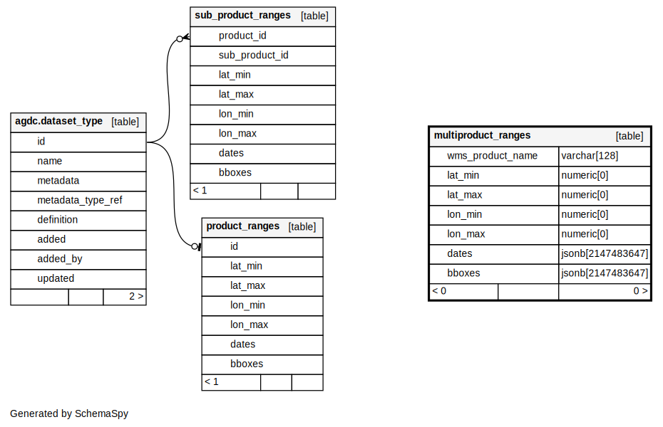

OWS Database Documentation
==========================

.. contents:: Table of Contents

Datacube OWS uses three groups of database
entities:

1. `ODC native entities <#open-data-cube-native-entities>`_
2. Public `materialised views over ODC indexes <#materialised-views-over-odc-indexes>`_
3. `OWS range tables <#range-tables-layer-extent-cache>`_.

Database relationship diagram
------------------------------

    Current database relationship diagram

Open Data Cube Native Entities
------------------------------

The core of the OWS database is the ``agdc`` schema used by the
`Open Data Cube <https://datacube-core.readthedocs.io/en/latest/>`_.
This schema is created and maintained with the ``datacube`` command.
OWS only needs read access to this schema.

Materialised Views over ODC Indexes
-----------------------------------

The materialised views provide a dataset level extent index
using `PostGIS <https://postgis.net>`_ datatypes.

These views are used only as an intermediate calculation
step to populate the Layer Extent Cache, as described below,
and for doing dataset queries for GetMap, GetFeatureInfo
and GetCoverage requests.

It is hoped that this layer will eventually be implemented as tables
maintained as part of the core ODC index.  Currently it must be
maintained separately using the ``datacube-ows-update`` (``update_ranges)``)
command.

===========================
Creating Materialised Views
===========================

The materialised views are created (along with the range tables,
as described below) with the ``--schema`` flag:

    ``datacube-ows-update --schema --role rolename``

where ``rolename`` is the name of the database role that the OWS server
instance will use.

=============================
Refreshing Materialised Views
=============================

As datasets are added into or archived out of the ODC database,
the materialised views become stale, and need to be periodically
manually refreshed, with the ``--view`` flag.

    ``datacube-ows-update --view``

A lot of the speed of OWS comes from pushing
expensive database calculations down into these materialised
views, and refreshing them is slow and computationally expensive.
Large, constantly updating databases will inavoidably have
some delay in the availability of the latest data.

Note that the last step of the view refresh (joining the time
and space views into a single space-time view) is done
CONCURRENTLY. This means that it may not take effect until
some minutes after ``datacube-ows-update`` exits.

DO NOT ATTEMPT TO REFRESH VIEWS NON-CONCURRENTLY IN A PRODUCTION
ENVIRONMENT. This will leave OWS broken and unable to respond to
requests until the refresh is complete.

In a production environment you should not be refreshing views
much more than 3 or 4 times a day unless your database is very small.

Range Tables (Layer Extent Cache)
----------------------------------

Range tables serve as a cache of full-layer spatio-temporal extents
for generating GetCapabilities documents efficiently.  They are
maintained with the ``datacube-ows-update`` (``update_ranges.py``)
command.

The range tables are created at the same time as the materialised
views using the ``--schema`` flag,
`as described above <#creating-materialised-views>`_.

=====================
Updating range tables
=====================

The range tables are updated from the materialised views by simply calling:

    datacube-ows-update

Note that this operation is very fast and computationally light
compared to refreshing the materialised views.

-------------------------------------------
Updating range tables for individual layers
-------------------------------------------

Specific layers can be updated using:

    datacube-ows-update layer1 layer2 layer3

(You can use OWS layer names or ODC product names here,
but OWS layer names are generally preferred).
