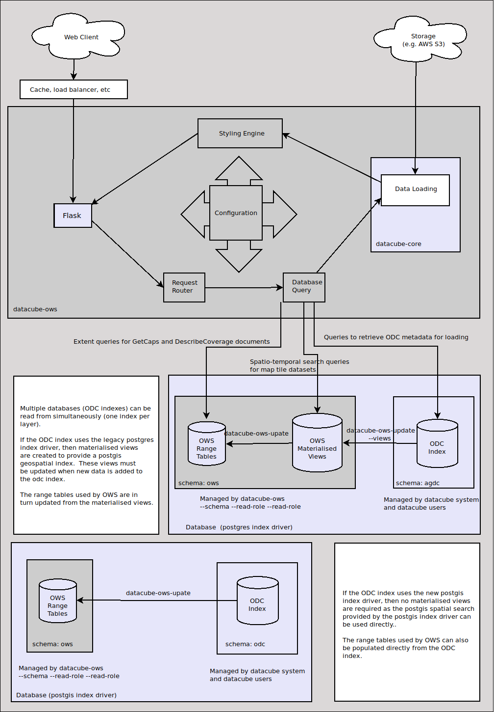

OWS Database Documentation
==========================

.. contents:: Table of Contents

Datacube OWS uses three groups of database
entities:

1. `ODC native entities <#open-data-cube-native-entities>`_
2. `OWS materialised views over ODC indexes <#materialised-views-over-odc-indexes>`_
3. `OWS range tables <#range-tables-layer-extent-cache>`_.

System Architecture Diagram
---------------------------

    OWS Architecture Diagram, including Database structure.

Open Data Cube Native Entities
------------------------------

The core of the Datacube-OWS application database is found in either
the ``agdc`` schema (for the legacy ``postgres`` index driver), or
the ``odc`` schema (for the new ``postgis`` index driver).
See
`Open Data Cube <https://datacube-core.readthedocs.io/en/latest/>`_.

This schema is created and maintained with the ``datacube`` command.
OWS only needs read access to this schema.

Materialised Views over ODC Indexes (Postgres driver only)
----------------------------------------------------------

The materialised views provide a dataset level extent index
using `PostGIS <https://postgis.net>`_ datatypes.

These views are used only as an intermediate calculation
step to populate the Layer Extent Cache, as described below,
and for doing dataset queries for GetMap, GetFeatureInfo
and GetCoverage requests.

The materialised views must be manually updated whenever new data
is added to the underlying ODC index, as described below.

With the new postgis index driver, the functionality provided by the
materialised views is available directly from the ODC index, and so
no materialised views are  required.

Ranges Table (Layer Extent Cache)
---------------------------------

Range tables serve as a cache of full-layer spatio-temporal extents
for generating GetCapabilities documents efficiently.

Creating/Maintaining the OWS Schema
-----------------------------------

Creating or updating an OWS schema is performed with following options to ``datacube-ows-update``.

Note that the options in this section requires database superuser/admin privileges.

===================================
Creating or Updating the OWS Schema
===================================

The ``--schema`` option to ``datacube-ows-update`` creates a new OWS schema if it does not exist, or
updates to the form required by the installed version of ``datacube-ows``::

    datacube-ows-update --schema

The ``--schema`` option creates/updates the OWS schema in the database defined by the ``default``
ODC environment only.  If you are using multiple ODC environments, or are simply not using the ``default``
environment, you will need to pass the target environment name with the ``-E`` option.  E.g. to
create an OWS schema in the ``myenv`` ODC environment::

    datacube-ows-update -E myenv --schema

==========================================
Cleaning up an old datacube-ows 1.8 schema
==========================================

In the 1.8.x series of datacube-ows releases, the OWS specific views and tables were stored somewhat haphazardly
in the misleadingly named ``wms`` schema with some entities in the ``public`` schema.

After upgrading OWS to a 1.9.x series release, these older database entities can be dropped from the database
with the ``--cleanup`` option::

    datacube-ows-update --cleanup

You can combine the ``--schema`` and ``--cleanup`` options in the one invocation::

    datacube-ows-update --schema --cleanup

The new schema is always created before dropping the old one, regardless of the order you specify the options.

The ``--cleanup`` option targets the ``default`` ODC environment database unless a target environment is supplied
with the ``-E`` option.

======================================
Granting permissions to database roles
======================================

The ``datacube-ows`` web application requires permissions to read from the various tables and views in the ``ows``
schema.  These can permissions (including read-access to the ODC tables can be granted to a database role with
the ``--read-role <role_name>`` argument::

    datacube-ows-update --read-role role1

You do not need to use --read-role and --write-role on the same user - granting write permissions automatically
grants read permissions as well.

The ``datacube-ows-update`` options that update the data in the OWS schema (described below) require read/write
permissions that can be granted with the ``--write-role <role_name>`` option::

    datacube-ows-update --write-role role2

The ``--read-role`` and ``write-role`` options can be used separately, together, and/or with the ``--schema``
and ``--cleanup`` options.  They can also be used multiple times in the one invocation to grant permissions to
multiple roles::

    datacube-ows-update --schema --cleanup --read-role role1 --read-role role2 --read-role role3 --write-role admin

The ``--read-role`` and ``--write-role`` options are executed against the ODC environment database identified
by the ``-E`` option  (Default is ``default``)::

    datacube-ows-update -E myenv --read-role role1 --read-role role2 --read-role role3 --write-role admin

Updating/Maintaining OWS data
-----------------------------

Updating/maintaining data in the OWS schema requires the permissions granted with ``--write-role``,
as described above.  It is performed with the following ``datacube-ows-update`` options:

=============================
Refreshing Materialised Views
=============================

As datasets are added into or archived out of the ODC database,
the materialised views become stale, and need to be periodically
manually refreshed, with the ``--views`` flag.

    ``datacube-ows-update --views``

A lot of the speed of OWS with the ``postgres`` index driver comes from pushing
expensive database calculations down into these materialised
views, and refreshing them is slow and computationally expensive.
Large, constantly updating databases will unavoidably have
some delay in the availability of the latest data.

Note that the last step of the view refresh (joining the time
and space views into a single space-time view) is done
CONCURRENTLY. This means that it may not take effect until
some minutes after ``datacube-ows-update`` exits.

DO NOT ATTEMPT TO REFRESH VIEWS NON-CONCURRENTLY IN A PRODUCTION
ENVIRONMENT. This will leave OWS broken and unable to respond to
requests until the refresh is complete.

In a production environment you should not be refreshing views
much more than 2 or 3 times a day unless your database is small
(e.g. less than a few thousand datasets).

If working with multiple ODC environments/databases, you can specify which
environment to refresh the materialised views in with the ``-E`` option.
(The default is to use the ``default`` environment.)

Materialised views are required for ``postgres`` index driver environments only.
In environments using the ``postgis`` index driver, the `--views` option
does nothing and may be skipped.

=====================
Updating range tables
=====================

The range tables are updated from the materialised views by simply calling:

    datacube-ows-update

Note that this operation is very fast and computationally light compared to refreshing the materialised views.

Range tables are updated in all ODC environments referenced by the active ODC configuration file.
The ``-E`` flag is therefore not valid for use with this calling mode.

In a ``postgres`` driver production environment, this should be run after refreshing the materialised views,
as described above (after waiting a couple of minutes for the final refresh to complete).

In a ``postgis`` driver production environment, this is the only required regular maintenance task.

===========================================
Updating range tables for individual layers
===========================================

Specific layers can be updated using:

    datacube-ows-update layer1 layer2 layer3

(In datacube-ows 1.8.x you could also use ODC product names, but this is no longer supported)

This will need to be done after adding a new layer to the OWS configuration, or after changing the time
resolution or the ODC product(s) of an existing layer.

The target OWS database for each layer is determined from OWS configuration, so the ``-E`` flag is invalid
with this calling mode.
